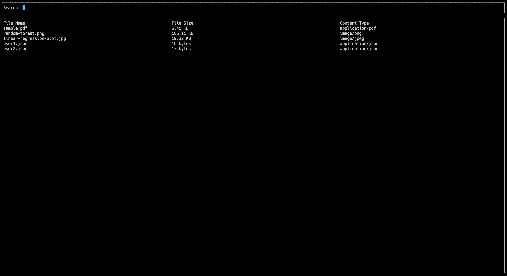

# Take Home Project

Challenge: A directory contains multiple files and directories of non-uniform file and directory names. Create a program that traverses a base directory and creates an index file that can be used to quickly lookup files by name, size, and content type.

## Running application


## Prerequisites
Before using this project, make sure you have the following prerequisites installed on your system:

- Python 3.x
- Pip (Python package manager)

## Installation

1. Run a virtual environment box:

   ```python
   # Create a virtual environment
    python -m venv venv

    # Activate the virtual environment (Windows)
    venv\Scripts\activate

    # Activate the virtual environment (macOS/Linux)
    source venv/bin/activate
   ```

2. Install all required libraries

    ```bash
    pip install -r requirements.txt
	 ```

## Usage

1. (Optional) Set BASE_DIRECTORY environment variable to pass a different path to index:

    ```bash
    export BASE_DIRECTORY=/path/to/custom_directory
    ```

2. Execute entrypoint file:

    ```bash
    python main.py
	```
